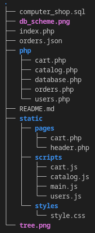
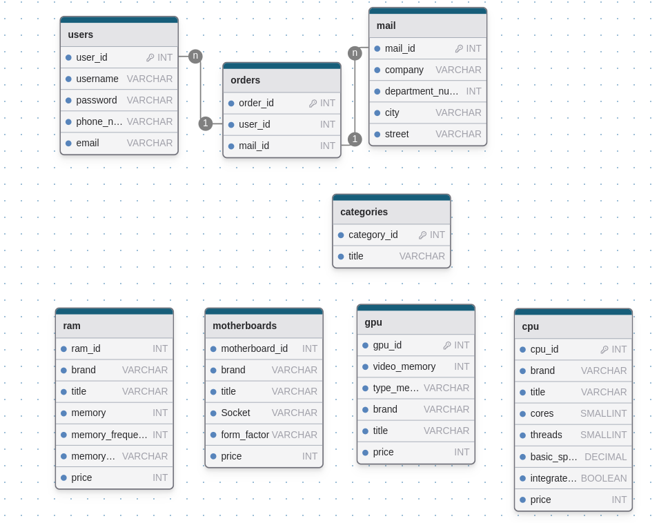

# Computer shop

*This webpage uses PHP version 8.3*

## Prerequisites
- You have installed and running [MySQL](https://www.mysql.com/)

## To start
1. Enter your password from MySQL database in php/database.php
2. Set up database
   1. Run: ```mysql -u root -p```
   2. Enter password
   3. Create database ```CREATE DATABASE computer_shop;```
   4. Switch to it ```USE computer_shop;```
   5. Then: ```SOURCE computer_shop.sql``` (This will create tables)
3. Run php server locally ```php -S localhost:8080 -t .```
4. Open http://localhost:8080/

# ToDo
## Level 1
- [X] Sort items by price
- [X] Filter items by characteristics
- [X] Cart chosen items
  - [X] Add/remove to/from cart
  - [X] Store order on submit in orders.json
  - [X] Clearing cart button
  - [X] Storing not submitted cart in DB
- [X] User can select only mails from DB
- [X] Submit pop up on "Enter"
## Level 2
- [X] Theme switcher
  - [X] Save user choice in localstorage
- [ ] Show quantity of items on "Cart" button in right corner of word
- [X] Remove price from filters
## Level 3
- [ ] Item details (pop up / separate page)
- [ ] Make categories in sidebar generating dynamically

## Little things & Bugs
- [ ] Make body in pop up, and clear it depending on body, not how it looks now
- [X] After delete item in cart on php Array of items transforms in object of items

## Project tree


## Database Scheme

