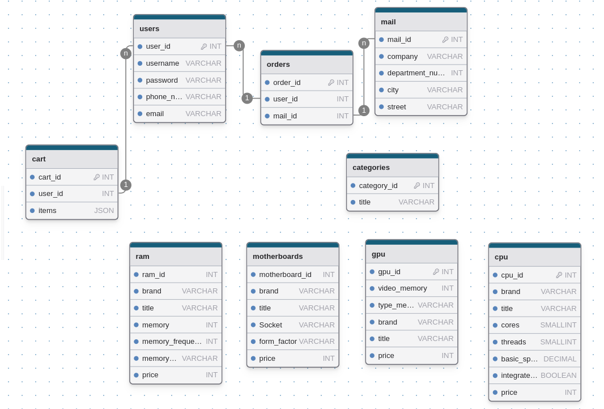

# Computer shop

## Functionality
- Theme switcher
   - Store user choice in localStorage
- Items displayed in lists, divided by categories
   - User can sort from cheap to expense
   - User can filter by items characteristics

## Prerequisites
- [PHP](https://www.php.net/)
- [MySQL](https://www.mysql.com/)

## To start
### Configure DB
- locally
- in docker
1. Enter your password from MySQL database in php/database.php
2. Set up database
   1. Run: ```mysql -u root -p```
   2. Enter password
   3. Create database ```CREATE DATABASE computer_shop;```
   4. Switch to it ```USE computer_shop;```
   5. Then: ```SOURCE computer_shop.sql``` (This will create tables)
3. Run php server locally ```php -S localhost:8080 -t .```
4. Open http://localhost:8080/

## ToDo:
- [ ] Mobile version
- [ ] Separate sign page for sign in / up
- [ ] Add items via separate page (How magazie owner)
- [X] Add PHPUnit tests
   - [ ] GitHub Actions
- [ ] Instead DOM manipulation make it in PHP

## Tests
- You can run tests via next command in terminal: ```composer test```
- Project have next tests:
   - Accessibility routes (home page, sign form)
   
## Database Scheme

